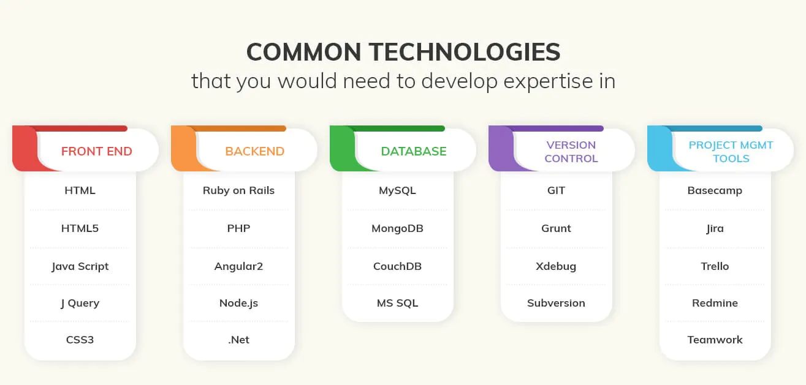
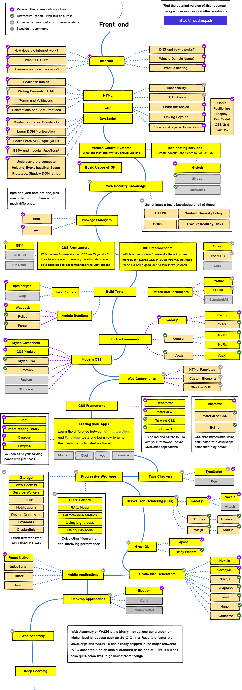

Version: Vietnamese
=================================
### What do web developers do?

Nói một cách ngắn gọn thì Web developer là người xây dụng và bảo trì các website. Họ thường làm việc với các Client -  những người muốn đưa sản phẩm, dịch vụ của mình lên trên web.

Web developer phù hợp với những ai thích giải quyết các vấn đề logic, xây dụng một sản phẩm hữu ích và có hứng thú, thích trải nghiệm các công nghệ mới.

### Types of web developers

**Front-end** là những thứ người dùng có thể nhìn thấy trên một trang  web như nội dung, hình ảnh, thanh điều hướng,... **Front-end developer** là người sử dụng HTML, CSS, Javasript và các framework để  trình bày các thành phần đó một cách hiệu quả, đem lại trải nghiệm tuyệt vời cho người dùng.

**Back-end** là thành phần mà người sử dụng trang web không thể thấy được. Nó nằm trên máy chủ và nó là thành phần xử lý các yêu cầu từ Client như lưu, tìm kiếm dữ liệu,... **Back-end developer** là người đảm nhận việc xây dụng bộ máy xử lý các vấn đề này. Ruby, Python, Java là những ngôn ngữ lập trình thường được sử  dụng khi lập trình Back-end.

**Full-stack developer** về cơ bản là người có thể làm việc với cả Font-end và back-end.

### Tools

Một số công cụ cơ bản thường dùng khi lập trình web như:

  - Text editor: Atom, VScode, Sublime, VIM,..
  - Command line interface (CLI)
  - Git
  - Google, Stack Overflow

### Motivation and Mindset

Cần có một tư duy mở, sẵn sàng tiếp thu những điều mới mẻ nằm ngoài vùng an toàn của bản thân.

Quá trình học sẽ bao gồm hiểu lý thuyết và ứng dụng nó vào thực tế. Điều này sẽ giúp bạn hiểu sâu hơn cách thức hoạt động và làm việc của chúng. Việc hoàn thành các project là cách đảm bảo ta đã hiểu lý thuyết và có thể ứng dụng nó vào thực tế.

Khi bế tắc, bạn có thể giải quyết nó bằng cách tra google (thường thì hầu hết các vấn đề bạn gặp phải thì cũng có người đã gặp phải và đã được giải quyết), giải lao (đây là một cách giúp bạn 'reset' lại đầu óc và giúp bộ não của bạn giải quyết vấn đề đó theo một hướng tiếp cận khác), hoặc bạn có thể hỏi ai đó có kinh nghiệm như thầy cô, bạn bè hoặc một ai đó trên diễn đàn,...

### Pitfalls to Avoid

Những điều cần tránh và phương pháp giải quyết đó là:
  - Sự trì hoãn => Sử dụng phương pháp Pomodoro
  - Không có khoảng thời gian nghỉ ngơi: Nghỉ ngơi là một phần quan trọng trong quá trình học tập, nó giúp bạn củng cố lại những kiến thức đã học, lấy lại năng lượng và khả năng tiếp tiếp kiến thức mới,... => Thiết lập thời gian giải lao vơí Pomodoro, trong thời gian thư giãn, ta có thể nghe nhạc, đi dạo, chơi một trò chơi mhanh, hoặc làm một chút việc nhà,..
  - Sự phân tâm vào các thông báo từ điện thoại, máy tính như tin nhắn, thông báo mạng xã hội, tiếng ồn từ tivi, xe cộ,... => Tắt các thông báo trong thời gian học. Tìm nơi phù hợp để tập trung học.
  - Sự xao lãng vào các tài nguyên, khóa học khác không liên quan hoặc hữu ích nhiều trong quá trình học => Xác định rõ con lộ trình học, những kiến thức cần và giới hạn thời gian lại để tránh xa lầy vào các 'lỗ thỏ'.
  - So sánh bản thân với người khác => Mỗi người có một điểm mạnh điểm yếu riêng nên việc so sánh là khập khiễn. Thay vì so sánh với người khác thì hãy so sánh với bản thân trong quá khứ xem bạn đã tiến bộ như thế nào sau 1 tuần, 1 tháng, hay 1 năm.

  > Bạn có thể tìm hiểu khóa học "Learning how to learn" trên Coursera để có thể tìm ra phương pháp học phù hợp với bạn. Ngoài ra bạn nên luyện tập "gõ 10 ngón" để có hiệu quả tốt nhất!

### Become a web developer
 > Để trở thành một lập trình viên Full-stack, ngoài kiến thức từ hai phần cơ bản là front-end và back-end thì cần thêm kiến thức về database (như SQL, noSQL, cache,...); version control system (như github, gitlab,... ); sử dụng command line, deploy (lên server như AWS, Azure,...); testing, fix bugs, bảo mật,...
 > 

> **Lộ trình trở thành một Web developer**
> 

> **Con đường trở thành một lập trình viên Front-end**
> 

> **Con đường trở thành một lập trình viên Back-end**
> 

> **Con đường trở thành DevOps**
> 